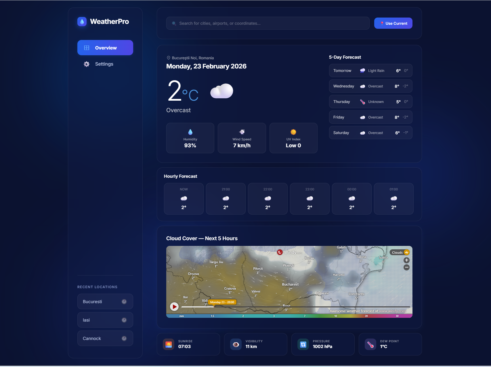
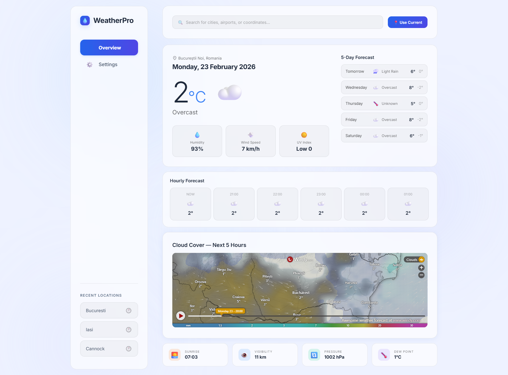

🌦️ WeatherPro — Modern Weather Dashboard
WeatherPro is a sleek, responsive, and theme‑adaptive weather dashboard built with React.js and JavaScript. It provides real‑time weather data, hourly and daily forecasts, cloud‑cover visualization, and a customizable interface that automatically adapts to the user’s system theme.

This project focuses on clean UI, modular components, and a smooth user experience powered by modern frontend practices.

 
     
     
     

<b>✨ Features</b>
<ul>
    <li>🌤️ Real‑Time Weather Data Current temperature, conditions, humidity, wind speed, UV index</li>
    <li>Hourly forecast with dynamic icons</li>
    <li>5‑day forecast with detailed summaries</li>
</ul>

<b>🗺️ Interactive Cloud Cover Map</b>
<ul>
    <li>Cloud‑cover animation for the next 5 hours</li>
    <li>Region‑aware map centered on the selected location</li>
</ul>

<b>🎨 Theme & Unit Customization</b>
<ul>
    <li>Light Glass, Dark Glass, or System theme</li>
    <li>Temperature units: Celsius / Fahrenheit</li>
    <li>Wind speed units: km/h, mph, m/s</li>
</ul>

<b>🔍 Smart Search Search by city, airport code, or coordinates</b>
<ul>
    <li>“Use Current Location” support</li>
    <li>Search history with quick access and “Clear All”</li>
</ul>

<b>🧩 Modular Architecture</b>
<ul>
    <li>Component‑based structure</li>
    <li>CSS Modules for scoped styling</li>
    <li>Reusable hooks for data fetching and formatting</li>
</ul>

<b>🛠️ Tech Stack</b>

<table>
  <tr>
    <th><b>Category</b></th>
    <th><b>Technologies</b></th>
  </tr>
  <tr>
    <td><b>Frontend</b></td>
    <td>React.js, JavaScript, Vite</td>
  </tr>
    <tr>
    <td><b>Styling</b></td>
    <td>CSS Modules, custom themes</td>
  </tr>
  </tr>
    <tr>
    <td><b>APIs</b></td>
    <td>Weather & geolocation APIs</td>
  </tr>
  </tr>
    <tr>
    <td><b>Build Tools</b></td>
    <td>Vite, ESLint</td>
  </tr>
</table>

<b>📁 Project Structure</b>
<pre>
Code
src/
 ├── assets/
 ├── components/
 │    ├── DailyForecast/
 │    ├── HourlyForecast/
 │    ├── SearchBar/
 │    ├── SettingsModal/
 │    ├── Sidebar/
 │    ├── StatCards/
 │    ├── WeatherHero/
 │    └── WeatherMap/
 ├── hooks/
 ├── styles/
 ├── utils/
 ├── App.jsx
 ├── App.module.css
 ├── main.jsx
 └── index.css
 
 </pre>

Each component folder contains:
<ul>
    <li>Component.jsx</li>
    <li>Component.module.css</li>
    <li>index.js</li>
</ul>

<b>🚀 Getting Started</b>
1. Clone the repository
<pre>
git clone https://github.com/your-username/weatherpro.git
cd weatherpro
</pre>
2. Install dependencies
<pre>
npm install
</pre>
3. Start the development server
<pre>
npm run dev
</pre>
4. Build for production
<pre>
npm run build
</pre>